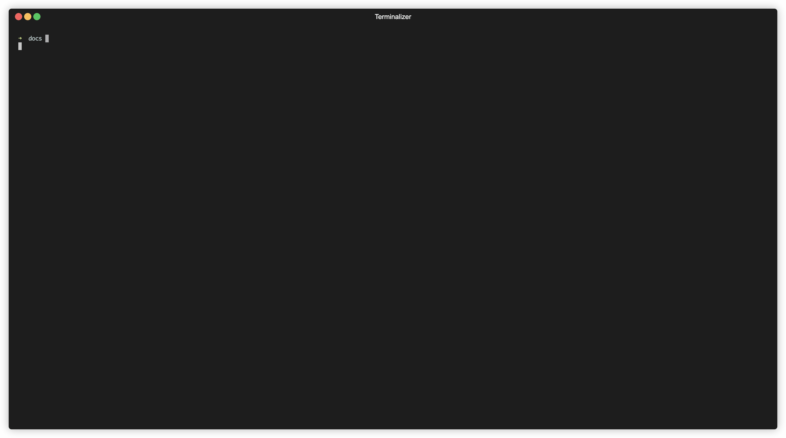

# kubectl-fzf

An interactive kubectl wrapper that uses [fzf](https://github.com/junegunn/fzf) for fuzzy resource selection, making Kubernetes operations more intuitive and faster.



## 🚀 Features

### Interactive Resource Selection
- **Fuzzy search**: Use fzf's powerful fuzzy matching to quickly find resources
- **Visual interface**: Clean, responsive selection interface with keyboard navigation
- **Smart filtering**: Intelligent resource listing based on command context
- **Dual syntax**: Use `:` shorthand or `--fzf` flag for activation

### Command Support
kubectl-fzf automatically handles resource listing for commands that require specific targets:

- `describe` - Describe specific resources
- `logs` - View logs from pods (automatically uses pods, no need to specify resource type)
- `delete` - Delete specific resources
- `edit` - Edit resource configurations

### Namespace Operations
- **Current namespace**: Work within your current kubectl context
- **Automatic namespace handling**: Properly formats commands with namespace flags
- **Cross-namespace**: Use `-A` or `--all-namespaces` to search across all namespaces


### Seamless Integration
- **Backward compatibility**: Falls back to original kubectl when `:` shorthand or `--fzf` flag is not used
- **Command history**: Integrates with zsh command history (commands appear in your shell history)
- **Error handling**: Graceful error messages and validation

## 📋 Prerequisites

- **kubectl**: Kubernetes command-line tool
- **fzf**: Command-line fuzzy finder ([installation guide](https://github.com/junegunn/fzf#installation))
- **zsh**: For optimal command history integration


## Quick Start / Try

1. Try kubectl-fzf without installation by source it in your current tab/session 
   
   ```bash
   $ source <(curl -sSL "https://raw.githubusercontent.com/codenio/kubectl-fzf/main/kubectl-fzf.sh")
   ```

2. Cross Check loading to function using `which kubectl` command
   ```bash
   $ which kubectl
   kubectl () {
        if ! command -v fzf &> /dev/null
        then
                echo "Error: fzf is not installed. Please install fzf and try again." >&2
                return 1
        fi
        ...
        ...
   }
   ```

## 🛠️ Installation

1. **Download the script**:
   ```bash
   $ curl -O https://raw.githubusercontent.com/codenio/kubectl-fzf/main/kubectl-fzf.sh
   ```

2. **Source the function** in your shell profile (`~/.zshrc`, `~/.bashrc`):
   ```bash
   $ source /path/to/kubectl-fzf.sh
   ```

3. **Reload your shell**:
   ```bash
   $ source ~/.zshrc  # or ~/.bashrc
   ```

#### or 

1. Directly source it your shell profile

   ```bash
   $ curl https://raw.githubusercontent.com/codenio/kubectl-fzf/main/kubectl-fzf.sh >> ~/.zshrc && source ~/.zshrc # or ~/.bashrc
   ```

## 🛠️ Un-Installation

### Temporary Removal (Current Session Only)

1. To remove from current session
   ```bash
   $ unset -f kubectl
   ```

2. Cross Check unsetting of function using `which kubectl` command
   ```bash
   $ which kubectl
   /Users/codenio/.rd/bin/kubectl
   ```

This removes the kubectl-fzf function from your current shell session. The original kubectl command will be restored.

### Permanent Removal

1. **Remove from shell profile**: Edit your `~/.zshrc` or `~/.bashrc` and remove/comment out the line:
   ```bash
   # source /path/to/kubectl-fzf.sh
   ```

2. **Reload your shell**:
   ```bash
   source ~/.zshrc  # or ~/.bashrc
   ```

3. **Verify removal**:
   ```bash
   which kubectl
   # Should show: /path/to/original/kubectl (not the function)
   ```

4. **Optional**: Delete the downloaded script file:
   ```bash
   rm /path/to/kubectl-fzf.sh
   ```

## 🎯 Usage

### Basic Syntax
```bash
# using the shorthand colon syntax:
kubectl <command> <resource-type> : [additional-flags]

# OR using the --fzf flag
kubectl <command> <resource-type> [additional-flags] --fzf
```

**Special case for logs**: 
```bash
# using shorthand:
kubectl logs : [additional-flags]  # No need to specify 'pod'

# using --fzf flag:
kubectl logs [additional-flags] --fzf
```

### Examples

#### Describe a Pod
```bash
# using shorthand:
kubectl describe pod : -n monitoring

# using --fzf flag
kubectl describe pod -n monitoring --fzf
```
1. Lists all pods in the monitoring namespace
2. Opens fzf for selection
3. Generates: `kubectl describe pod <selected-pod> -n monitoring`

#### View Logs with Options
```bash
# using shorthand:
kubectl logs : -f --tail=100

# using --fzf flag
kubectl logs -f --tail=100 --fzf
```
1. Automatically lists all pods via fzf (no need to specify 'pod')
2. Select a pod from the list
3. Generates: `kubectl logs <selected-pod> -f --tail=100`

#### Cross-Namespace Operations
```bash
# using shorthand:
kubectl describe pod : -A

# using --fzf flag
kubectl describe pod -A --fzf
```
1. Lists pods from all namespaces
2. Automatically includes namespace in final command
3. Generates: `kubectl describe pod <selected-pod> -n <namespace>`

#### Delete Resources
```bash
# using shorthand:
kubectl delete deployment : --cascade=foreground

# using --fzf flag
kubectl delete deployment --cascade=foreground --fzf
```
1. Lists deployments for selection
2. Generates: `kubectl delete deployment <selected-deployment> --cascade=foreground`


### Debug Mode
Enable debug output to see how commands are processed:

```bash
# using shorthand:
kubectl describe pod : --debug

# using --fzf flag:
kubectl describe pod --debug --fzf
```

Debug output shows:
- Parsed subcommand and object
- Additional flags detected  
- Namespace mode (current vs all)
- List command used for fzf
- Final command structure

## 🔧 How It Works

1. **Command Detection**: Detects presence of `:` shorthand or `--fzf` flag
2. **Smart Listing**: For commands like `describe`, `logs`, `delete`, `edit`, uses `kubectl get` to list resources
3. **Interactive Selection**: Presents resources in fzf for fuzzy selection with customized height and layout
4. **Command Generation**: Builds final kubectl command with selected resource and original flags
5. **History Integration**: Uses `print -rz` to add command to zsh history for easy re-execution

## ⚡ Performance Features

- **Optimized parsing**: Efficient flag processing with arrays instead of string concatenation
- **Smart caching**: Minimal external command calls
- **Error-first validation**: Quick validation before expensive operations
- **Parallel-safe**: Proper variable scoping with `local` declarations

## 🛡️ Error Handling

- **Dependency check**: Validates fzf installation
- **Resource validation**: Confirms resources exist before presenting selection
- **Selection validation**: Handles user cancellation and invalid selections
- **Proper error output**: Error messages directed to stderr

## 🔄 Compatibility

### Shell Compatibility
- **Full support**: zsh (with command history integration)
- **Basic support**: bash (without command history integration)

### kubectl Version
Compatible with all modern kubectl versions. The script uses standard kubectl commands and output formats.

### Platform Support
- ✅ macOS
- ✅ Linux  
- ✅ WSL2

## 🤝 Contributing

Contributions are welcome! Please feel free to submit issues, feature requests, or pull requests.

### Development
To test changes:
```bash
# Enable debug mode
kubectl describe pod : --debug
kubectl describe pod --fzf --debug 

# Test cross-namespace
kubectl get pod : -A --debug
kubectl get pod -A --fzf --debug
```

## 🚧 Todo / Roadmap

### Planned Features
- **Port forwarding support**: `kubectl port-forward` integration with fzf selection
- **Extended shell support**: Improved bash compatibility and fish shell support

### Performance Improvements
- **Caching layer**: Cache resource listings for faster subsequent operations
- **Parallel processing**: Optimize resource fetching for large clusters

### User Experience
- **Custom fzf options**: Allow users to configure fzf behavior and appearance
- **Resource previews**: Show resource details in fzf preview pane
- **History integration**: Better command history and favorite commands

Contributions and feature requests are welcome! Feel free to open an issue to discuss any of these features.

## 📝 License

MIT License - see [LICENSE](LICENSE) file for details.

## 🙏 Acknowledgments

- [fzf](https://github.com/junegunn/fzf) - The fantastic fuzzy finder that makes this possible
- [kubectl](https://kubernetes.io/docs/reference/kubectl/) - The Kubernetes command-line tool
